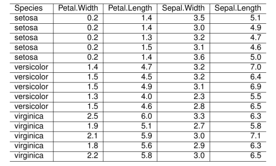
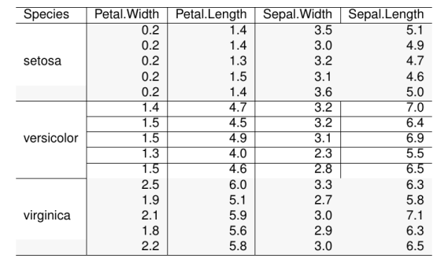
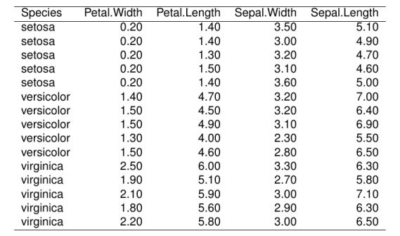
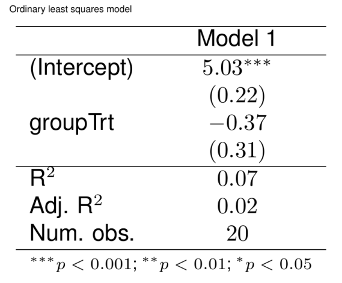
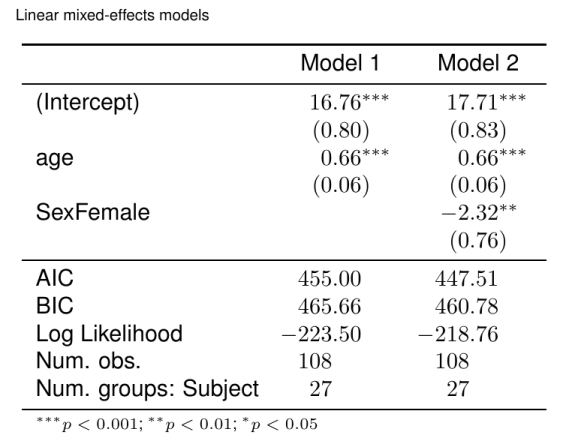

```r
library(texPreview)

tex_opts$set( 
  returnType = 'html',
  opts.html   = list(width = '75%', height = '75%')
)
```

## knitr

### kable


```r

iris_rev <- iris[c(1:5,51:55,101:105),rev(names(iris))]

iris_rev |>
  knitr::kable(format = "latex",row.names = FALSE) |>
  tex_preview()
```



### kableExtra


```r

iris_rev |>
  knitr::kable(format = "latex",row.names = FALSE) |>
  kableExtra::kable_styling(latex_options = 'striped',
                            stripe_index = c(1:5,11:15)) |>
  kableExtra::collapse_rows(columns = c(1)) |>
  tex_preview()
```



## xtable


```r

iris_rev |>
  xtable::xtable() |>
  tex_preview(print.xtable.opts = list(include.rownames = FALSE))
```




## texreg

### Ordinary least squares model (example from the 'lm' help file)


```r

ctl <- c(4.17,5.58,5.18,6.11,4.50,4.61,5.17,4.53,5.33,5.14)
trt <- c(4.81,4.17,4.41,3.59,5.87,3.83,6.03,4.89,4.32,4.69)
group <- gl(2,10,20, labels = c("Ctl","Trt"))
weight <- c(ctl, trt)

lm(weight ~ group) |>
  texreg::texreg(caption.above = TRUE,
                 caption  = 'Ordinary least squares model') |>
  texPreview::tex_preview()
#> Warning: Package varwidth Warning: Failed to reprocess entire contents on input line
#> 20.

#> Warning: Package varwidth Warning: Failed to reprocess entire contents on input line
#> 20.
```



### Linear mixed-effects models


```r

library(nlme)

model.1 <- lme(distance ~ age, data = Orthodont, random = ~ 1)
model.2 <- lme(distance ~ age + Sex, data = Orthodont, random = ~ 1)

list(model.1, model.2) |>
  texreg::texreg(booktabs = TRUE, 
                 dcolumn = TRUE,
                 caption.above = TRUE,
                 caption  = 'Linear mixed-effects models') |>
  texPreview::tex_preview()
#> Warning: Package varwidth Warning: Failed to reprocess entire contents on input line
#> 21.

#> Warning: Package varwidth Warning: Failed to reprocess entire contents on input line
#> 21.
```


