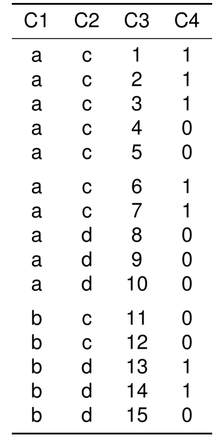
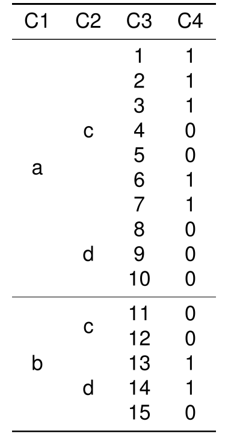

```r
library(texPreview)

tex_opts$set( 
  returnType = 'html',
  opts.html   = list(width = '50%', height = '50%')
)
```

## read the lines in the tex file


```r

tex_file <- system.file('examples/toy/toy.tex',package = 'texPreview')
```


```r

readLines(tex_file)
#>  [1] "\\begin{tabular}{cccc}" "\\toprule"              "C1 & C2 & C3 & C4\\\\" 
#>  [4] "\\midrule"              "a & c & 1 & 1\\\\"      "a & c & 2 & 1\\\\"     
#>  [7] "a & c & 3 & 1\\\\"      "a & c & 4 & 0\\\\"      "a & c & 5 & 0\\\\"     
#> [10] "\\addlinespace"         "a & c & 6 & 1\\\\"      "a & c & 7 & 1\\\\"     
#> [13] "a & d & 8 & 0\\\\"      "a & d & 9 & 0\\\\"      "a & d & 10 & 0\\\\"    
#> [16] "\\addlinespace"         "b & c & 11 & 0\\\\"     "b & c & 12 & 0\\\\"    
#> [19] "b & d & 13 & 1\\\\"     "b & d & 14 & 1\\\\"     "b & d & 15 & 0\\\\"    
#> [22] "\\bottomrule"           "\\end{tabular}"
```

## convert lines into knitr_kable 


```r

kbl <- tex_file |>
  texPreview::as.kable()
```

## preview the table


```r

kbl |>
  texPreview::tex_preview()
```



## use kableExtra to manipulate the table and preview


```r

kbl |>  
  kableExtra::collapse_rows(columns = 1:2, 
                            latex_hline = "major", 
                            valign = "middle") |>
  texPreview::tex_preview()
```


