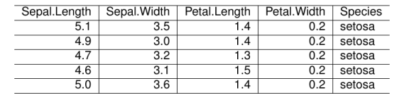
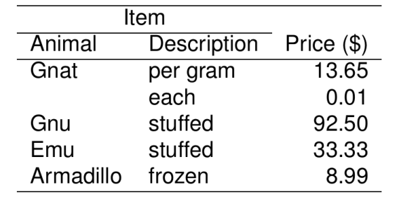

```r
library(texPreview)

tex_opts$set( 
  returnType = 'html',
  opts.html   = list(width = '75%', height = '75%')
)
```

The following examples use `kable` to generate LaTeX table outputs and raw LaTeX to pipe into `tex_preview` to render the in the document.

## Kable Input


```r

knitr::kable(head(iris,5),format = 'latex') |>
tex_preview()
```



## TeX Input


```r
tab='
\\begin{tabular}{llr}
\\hline
\\multicolumn{2}{c}{Item} \\\\
\\cline{1-2}
Animal    & Description & Price (\\$) \\\\
\\hline
Gnat      & per gram    & 13.65      \\\\
          & each        & 0.01       \\\\
Gnu       & stuffed     & 92.50      \\\\
Emu       & stuffed     & 33.33      \\\\
Armadillo & frozen      & 8.99       \\\\
\\hline
\\end{tabular}'

tab |>
  tex_preview()
```


