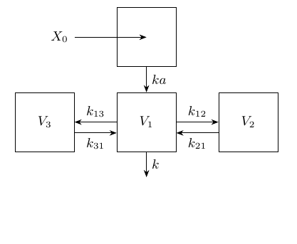
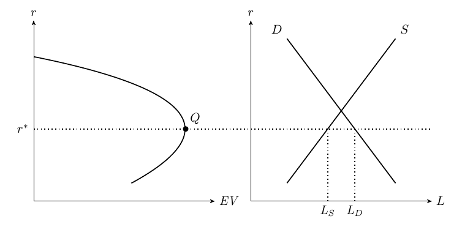

texPreview can be used for any TeX input beyond tabular environments, such as `tikz`. In the following examples we input a `tikzpicture` and an entire TeX file that contains a `tikz` environment.


```r
library(texPreview)
```


```r
# add tikz support to tex_opts
use_lib <- "\\usetikzlibrary{arrows,shapes,decorations,automata,backgrounds,arrows.meta,positioning}"

objpath <- file.path(getwd(),"tikz_files/figure-html")

if(!dir.exists(objpath))
  dir.create(objpath,recursive = TRUE)

tex_opts$set(
  fileDir    = objpath, # path to save output
  returnType  = 'html',
  usrPackages = build_usepackage(pkg = 'tikz',uselibrary = use_lib)
)
```


```r
tikz_examples <- list.files(system.file('examples/tikz',package = 'texPreview'),
                          pattern = 'tex$',full.names = TRUE)
tikz_code <- lapply(tikz_examples,
                    function(x) paste0(readLines(x),collapse = '\n'))
names(tikz_code) <- basename(tikz_examples)
```

## tikzpicture


```r
tex_preview(obj = tikz_code$pk_model.tex,stem = 'tikz-1')
```



<details closed>
<summary> <span title='Click to Expand'> Click to view TeX </span> </summary>

```tex

\begin{tikzpicture}[
    mysquare/.style={
    rectangle,
    draw=black,
    fill=white,
    fill opacity = 0.3,
    text opacity=1,
    inner sep=0pt,
    minimum size=40pt,
    font=\small,
    align=center},
    myarrow/.style={-Stealth},
    node distance=0.6cm and 1.0cm
  ]

  \node[mysquare] (c1) {Prol};
  \node[mysquare,draw=white,minimum size=20pt,below left= of c1] (e) {$E_{drug}$};
  \node[mysquare, minimum size=30pt,right=of c1] (t1) {Transit\\1};
  \node[mysquare, minimum size=30pt, right=of t1] (t2) {Transit\\2};
  \node[mysquare, minimum size=30pt, right=of t2] (t3) {Transit\\3};
  \node[mysquare, right=of t3] (c2) {Circ};
  \node[mysquare,draw=white,below= of c2] (k) {};
  \node[mysquare,draw=white,minimum size=20pt,font=\small,above left= of c1] (kp) {$k_{prol}(=k_{tr})$};

    \foreach \i/\j/\txt/\p/\r in {% start node/end node/text/position/rotation
      c1/t1/$k_{tr}$/above/0,
      t1/t2/$k_{tr}$/above/0,
      t2/t3/$k_{tr}$/above/0,
      t3/c2/$k_{tr}$/above/0,
      c2/k/$k_{circ}(=k_{tr})$/right/90
    }
    \draw [myarrow] (\i) -- node[sloped,font=\small,\p,rotate=\r] {\txt} (\j);

  \draw [-Stealth] (c2) edge[in=85,out=90,looseness=0.5] node[above]{Feedback=$\left( \frac{Circ_0}{Circ} \right)^\gamma$}(c1);

  \path (c2) edge[in=315,out=225,looseness=0.5] node[below]{MTT}(c1);

  \draw [-Stealth] (c1) edge [out=95,in=150,looseness=8] node[above left] {} (c1);
  \draw [-Stealth] (e) edge [out=90,in=270] node[left] {} (kp);

\end{tikzpicture}

```

</details>
<br>

## File

For a full TeX document use the `tex_lines` argument instead of the `obj`. This input bypasses the internal document template that is used for texPreview and renders the contents of the file directly. 


```r
tex_preview(tex_lines = tikz_code$credit_rationing.tex,stem = 'tikz-2')
```



<details closed>
<summary> <span title='Click to Expand'> Click to view TeX </span> </summary>

```tex

% Author: Rasmus Pank Roulund
\documentclass[varwidth, border={ 10 5 10 5 }]{standalone}
\usepackage{tikz}
\usepackage{verbatim}

\begin{comment}
:Title: Credit rationing

An illustration inspired by a figure in Stiglitz, J.E. and Greenwald, B. (2003). `Towards a New Paradigm in Monetary Economics`__.

.. __: http://books.google.com/books?id=dZrI_dHoKgUC&dq=Towards+a+new+paradigm+for+monetary+economics&source=bn&ei=fDKXSbmrJMaC-gbQ_Pj8CA&sa=X&oi=book_result&resnum=4&ct=book-ref-page-link&cad=one-book-with-thumbnail

\end{comment}
\usetikzlibrary{arrows,calc}
\tikzset{
%Define standard arrow tip
>=stealth',
%Define style for different line styles
help lines/.style={dashed, thick},
axis/.style={<->},
important line/.style={thick},
connection/.style={thick, dotted},
}
\begin{document}
  \begin{tikzpicture}[scale=1]
    % Axis
    \coordinate (y) at (0,5);
    \coordinate (x) at (5,0);
    \draw[<->] (y) node[above] {$r$} -- (0,0) --  (x) node[right]
    {$\mathit{EV}$};
    % A grid can be useful when defining coordinates
    % \draw[step=1mm, gray, thin] (0,0) grid (5,5); 
    % \draw[step=5mm, black] (0,0) grid (5,5); 

    % Let us define some coordinates
    \path
    coordinate (start) at (0,4)
    coordinate (c1) at +(5,3)
    coordinate (c2) at +(5,1.75)
    coordinate (slut) at (2.7,.5)
    coordinate (top) at (4.2,2);

    \draw[important line] (start) .. controls (c1) and (c2) .. (slut);
    % Help coordinates for drawing the curve
    % \filldraw [black] 
    % (start) circle (2pt)
    % (c1) circle (2pt)
    % (c2) circle (2pt)
    % (slut) circle (2pt)
    \filldraw [black] 
     (top) circle (2pt) node[above right, black] {$Q$};

     % We start the second graph
     \begin{scope}[xshift=6cm]
       % Axis
      \coordinate (y2) at (0,5);
      \coordinate (x2) at (5,0);
      \draw[axis] (y2) node[above] {$r$} -- (0,0) --  (x2) node[right] {$L$};
      % Define some coodinates
     \path
     let
     \p1=(top)
     in
     coordinate (sstart) at (1,.5) 
     coordinate (sslut) at (4, 4.5)
     coordinate (dstart) at (4,.5)
     coordinate (dslut) at (1,4.5)
% Intersection 1
     coordinate (int) at  (intersection cs:
       first line={(sstart)--(sslut)},
       second line={(dstart)--(dslut)})
% Intersection 2
    coordinate (int2) at  (intersection cs:
       first line={(top)--($(10,\y1)$)},
       second line={(dstart)--(dslut)})
% Intersection 3
    coordinate (int3) at  (intersection cs:
       first line={(top)--($(10,\y1)$)},
       second line={(sstart)--(sslut)});
% Draw the lines
     \draw[important line] (sstart) -- (sslut) node[above right] {$S$}
       (dstart) -- (dslut)  node[above left] {$D$};
     \draw[connection] let \p1=(int2), \p2=(int3) in 
     (int2)--(\x1,0) node[below] {$\mathit{L_D}$}
     (int3)--(\x2,0) node[below] {$\mathit{L_S}$};
      \end{scope}
%Finally, connect the two graphs
     \draw[connection] let \p1=(top), \p2=(x2) in (0,\y1) node[left]
     {$r^*$} -- (\x2, \y1);
    \end{tikzpicture}
  \end{document}

```

</details>
<br>
